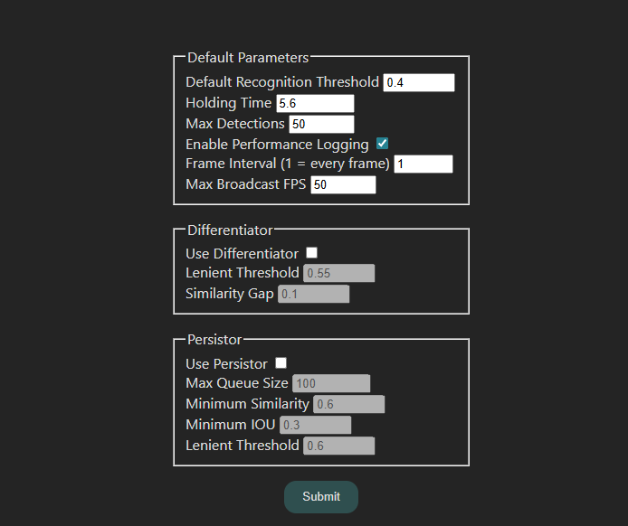
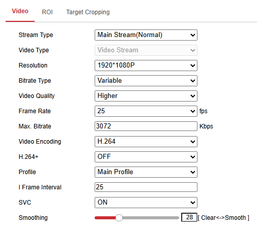

# SimpliFRy


---

## Table of Contents

- [Overview](#overview)
- [Installation](#installation)
- [Pages & Endpoints](#pages--endpoints)
- [Data Directory](#data-directory)
- [Configuration](#configuration)
- [Advanced Configuration](#advanced-configuration)

---

## Overview

**SimpliFRy** is the core facial recognition component of **FRS 3**. It is a locally-hosted web application built using Python 3.10 and [Flask](https://github.com/pallets/flask), providing real-time face detection, embedding generation, and result streaming.

For integration with Gotendance or deployment instructions, refer to the [main README](../ReadME.md).  
For the technical deep dive, see the [Developer Guide](./Developer%20Guide.md)

---

## Installation

> For complete setup instructions including Gotendance, refer to the [main README](../ReadME.md#installation--setup-simplifry--gotendance)

### Prerequisites
- [Docker](https://www.docker.com/products/docker-desktop/) and [Docker Compose](https://docs.docker.com/compose/install/)
- [Nvidia Container Toolkit](https://docs.nvidia.com/datacenter/cloud-native/container-toolkit/latest/install-guide.html) (for GPU support in Docker)
- [Python 3.10+](https://www.python.org/downloads/) (for local development without Docker)
- [FFmpeg 8.0.1+ ](https://ffmpeg.org/download.html) 


### Quick Start (only for SimpliFRy)

**Using Docker (Recommended):**
```bash
cd simpliFRy
docker compose build simplifry
docker compose up simplifry
```

**For Local Development:**
```bash
python -m venv venv
venv\Scripts\activate  # macOS/Linux: source venv/bin/activate
pip install -r requirements.txt
python app.py
```

Access the application at **http://localhost:1333**

The `buffalo_l` model will auto-install on first run. A copy of `buffalo_l.zip` is also provided in the `/simpliFRy` directory.

---

## Pages & Endpoints

### Web Pages

- `/` - Main interface for starting video streams and initiating FR
- `/seats` - Seating layout view (for organized venue tracking)
- `/old_layout` - Alternative layout for different use cases
- `/settings` - Configuration and data loading page

### API Endpoints

- `GET /api/frResults` - HTTP streaming endpoint for real-time recognition results  
  - Used by Gotendance to track attendance
  - Returns JSON stream of detected faces with labels

---

## Data Directory

The `/data` directory is auto-created and contains:

```
data/
├── logs/              # Auto-generated application logs per session
├── flags/             # Flag images for display (optional)
├── pictures/          # Reference images for people
└── namelist.json      # Personnel mapping file
```

**Important**: This directory is volume-mounted in Docker, making it the primary way to exchange data with the container.

> For instructions to setup images and JSON file, refer to the [main ReadME](../ReadME.md#data-preparation). 

---

## Configuration

### Environment Variables (`.env` file)

Create or modify `.env` in the SimpliFRy directory:

```
APP_IP=0.0.0.0
APP_PORT=1333
APP_ENV=production        # "production" or "development"

# Video settings
STREAM_JPG_QUALITY=75     # JPEG compression (1-100)
WIDTH=1920                # Video resolution width
HEIGHT=1080               # Video resolution height

# Inference settings (optimized for speed/accuracy)
INFERENCE_WIDTH=640       # Model input width
INFERENCE_HEIGHT=480      # Model input height
```

### Runtime Settings (via UI)

Access detailed FR algorithm settings at `/settings`



> For detailed parameter documentation, see the [Developer Guide](./Developer%20Guide.md#configuration).

### Recommended HIKVISION Camera Settings

In Fusion Company, we typically use HIKVISION IP cameras to provide RTSP input during deployment. As of Feb 2026, we use the HIKVISION iDS-2CD7A46G0-IZHS. 

Video settings can be adjusted in the HIKVISION Video Management Software, which can be accessed by typing the IP address of the camera into the search bar of your browser. These are the typical settings we use, to balance low-latency and acceptable video quality.



Image settings can also be changed to adjust exposure, contrast, dynamic range and more. These should be tuned to ensure a clear image given the lighting conditions of the deployment site. 

---

## Advanced Configuration

### Customization

**Page Titles**: Edit HTML templates in `./templates/` to change page titles:
```html
<div class="title">YOUR CUSTOM TITLE</div>
```

**Seating View Background**: Replace `./static/images/seats_bg.png` with your custom venue image. 

For a fully custom background, you would have to insert it into the body of the page. E.g.
```html
<body background="../static/images/bg_image.png" style="background-size: cover">
  ...
</body>

```